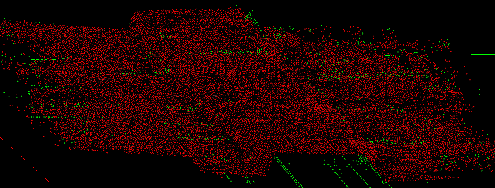

# AU RnD Project
This repository contains the source code for a 5 ECTS Research and Development Project [Course](https://kursuskatalog.au.dk/da/course/75888/Research-and-Development-Project-in-Engineering-A-5-ECTS) at Aarhus University. The project has been done in collaboration with [EIVA](https://www.eiva.com/), who has supplied the experimental data.

The purpose of the project has been to find an efficient and effective method of filtering the noise samples in a sonar point cloud measurement. The project explores using both statistical procedures and traditional machine learning methodologies to accomplish this goal, but focuses on a statistical outlier detection method based on Robust PCA (RPCA).

## External libraries
* https://github.com/dganguli/robust-pca (no licence specified)
